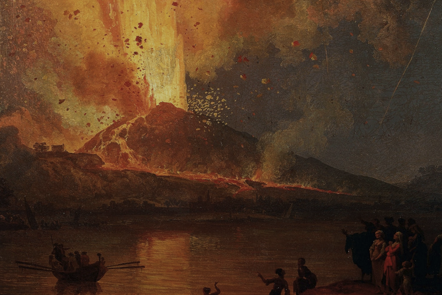

# Exploring survival during Pompeii eruption (Vesuivius)

**Group members :**

|        Name       |        Major           |        Email              |         
|-------------------|------------------------|---------------------------|
| Lucas VALERION    | Computer science       |lucas.valerion@gmail.com   |
| Thomas BUCHLER    | Computer science       |thomas.buchler@edu.ece.com |
| Albane PATUREL    | Computer science       |albane.paturel@edu.ece.fr  |
| Zoé BOUSQUENAUD   | Computer Science       |zoe.bousquenaud@gmail.com  |

## **Proposal :**

&emsp;Hello blabla éruption vésuve morts pouf

Kaggle datasets we will use : - https://www.kaggle.com/datasets/jessemostipak/volcano-eruptions
- https://www.kaggle.com/code/mrisdal/exploring-survival-on-the-titanic/report
&emsp;Link on history we will use : https://en.wikipedia.org/wiki/Pompeii

## **Description of the Dataset :**

&emsp;This dataset includes 11 columns: PassengerId, Survived, DistanceFromV, Name, Sex, Age, WealthIndex, ShelterAccess, HasPet, ReactionTime, and Status. It contains numerical features like age, distance from Vesuvius, and wealth index, as well as boolean variables such as survival and shelter access.

&emsp;We created this dataset to simulate the situation of individuals during the Vesuvius eruption and explore how different factors may have influenced their survival. Some details, like injury level, were intentionally excluded as they were not relevant to our project’s objectives.

